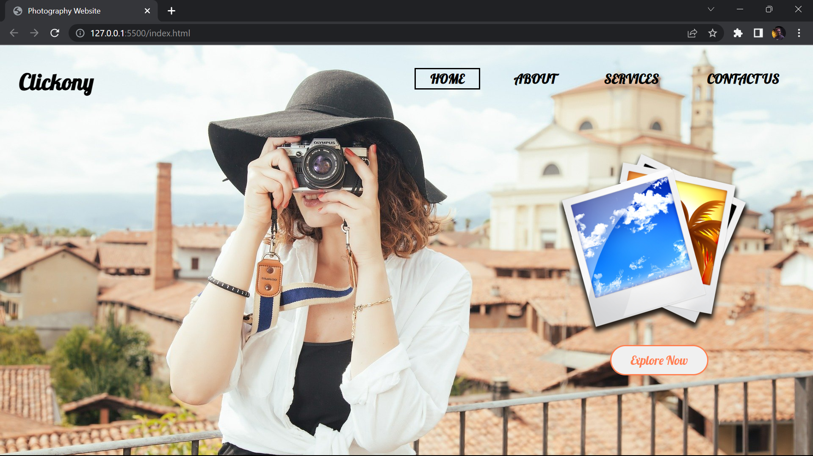
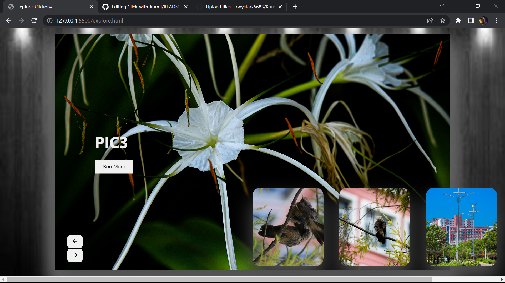

# Photography Website

Welcome to the Photography Website repository! This repository contains the code for a simple yet elegant photography website. It features a landing page, an image slider page, and an add-to-cart functionality for easy purchasing.

## Introduction
This website serves as a platform to showcase stunning photography and provide users with the ability to explore captivating images. Whether you're a professional photographer looking to display your work or a photography enthusiast seeking inspiration, this website aims to provide a visually immersive experience.

## Features
1. **Landing Page**: A visually appealing landing page that showcases stunning photographs and provides an introduction to the website.

2. **Image Slider Page**: A page that displays a collection of images in an interactive slider format, allowing users to browse through captivating visuals.

3. **Add-to-Cart Functionality**: Users can add selected photographs to their cart for purchase, making it convenient to acquire the images they love.

## Tools Used
The following technologies and tools were used to develop and build this photography website:

- HTML5 and CSS3: Markup and styling of web pages.
- JavaScript: Client-side scripting language for interactive functionality.
- React: A JavaScript library for building user interfaces.
- React Router: Library for handling routing within the React application.
- Redux: A state management library for predictable and scalable application state.
- Axios: A promise-based HTTP client for making API requests.
- Bootstrap: A CSS framework for responsive and mobile-first web development.
- Webpack: A module bundler used for packaging the application's assets.
- npm: Package manager for installing project dependencies.
- Git: Version control system for tracking changes in the source code.

## Installation
1. Clone the repository:
   git clone https://github.com/tonystark5683/Click-with-kurmi.git
2. Navigate to the project directory:
   cd photography-website
3. Install the dependencies:
   npm install
4. Start the development server:
   npm start
